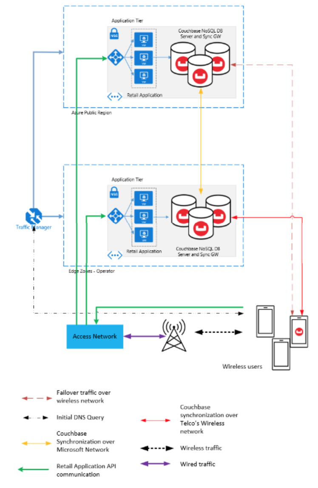

# Deployment Guide

The retail industry is modernizing their applications, many of which are latency sensitive, need high availability and would need distributed edge computing capabilities in order to support them. Azure Edge Zones combined with Couchbase’ highly scalable, distributed and embedded database can provide the perfect platform for such applications.

In this deployment guide we will detail how to deploy the architecture in Microsoft Azure to support this retail use case. We will be deploying the following resources:

- A VM in the cloud running the following:

  - Couchbase Server
  - Couchbase Sync Gateway
  - A Retail Web Application

- A VM in the edge zone running the following:

  - Couchbase Server
  - Couchbase Sync Gateway
  - A Retail Web Application

<!-- - A mobile application embedded with Couchbase Lite
- An Azure Traffic manager -->

Please see the diagram of the architecture we will be deploying below.



## Prerequisites

Install Azure CLI Version [(Install Azure CLI)](https://docs.microsoft.com/en-us/cli/azure/install-azure-cli?view=azure-cli-latest)

<hr>

## Setting up Cloud Tier

### Setting up Virtual Machine

<ol>
<li> Creating a resource group

```
az group create --name <resource_group_name> --location <location_name>
```

</li>
<li>
Creating a VNET with a subnet

```
az network vnet create -g <resource_group_name> -n <vnet_name> --address-prefix <vnet_prefix> --subnet-name <subnet_name> --subnet-prefix <subnet_prefix> --location <location_name>
```

</li>
<li>
Creating a Virtual Machine

```
az vm create --resource-group <resource_group_name> --name <vm_name> --image UbuntuLTS --admin-username <user> --generate-ssh-keys --location <location_name> --subnet <subnet_name>  --vnet-name <vnet_name> --public-ip-sku Standard
```

</li>

Please note where the generated ssh keys are saved to.

</ol>

### Networking Rules

Please login into the Azure portal Web UI and navigate to virtual machines. Select the virtual machine you just created and select the networking tab. Select add inbound port rules and add the following destination port ranges:

<ol>
<li>Destination port ranges for Couchbase Server and Sync Gateway:

```
8091-8093,11207,11210-11211,18091-18093,4984-4985
```

</li>
<li>Destination port ranges for Webserver:

```
8080
```

</li>
</ol>

### Install and Set up Couchbase Server

#### SSH into VM

Please `cd` into the directory your generated ssh key is located in and run the following command:

```
ssh -i <YOUR_KEY> <admin-username>@<public_ip>
```

You should now have access to the virtual machine.

#### Couchbase Server Installation

<ol>
<li>Download the meta package.

```
curl -O https://packages.couchbase.com/releases/couchbase-release/couchbase-release-1.0-amd64.deb
```

</li>
<li>Install the meta package.

```
sudo dpkg -i ./couchbase-release-1.0-amd64.deb
```

</li>
<li>Reload the local package database

```
sudo apt-get update
```

</li>
<li>Install Couchbase Server

```
sudo apt-get install couchbase-server
```

</li>
</ol>

The latest version of Couchbase is now installed. Please verify that Couchbase Server is running by running the following command:

```
systemctl status couchbase-server
```

If Couchbase Server is not running, please run the following command:

```
sudo systemctl start couchbase-server
```

#### Setting up cluster

<ol>
  <li> Now that Couchbase server is running, the console can be accessed over the network at http://machine-ip-address:8091/. You should now be met with the Couchbase Server welcome screen.<ol>
  <li>Please select Setup New Cluster. 
  You will now be prompted to name your cluster and create an admin username and password. </li>
  <li>Once you have done this, please check that you agree to the terms and conditions, then select Configure Disk, Memory and Services. </li>
  <li>Please check the following services: Data, Query, Index. Leave the memory quotas as default. Select save and finish.</li></ol>
  </li>
  <li>Navigate to the buckets tab. 
  <ol><li>Select add bucket and create a new bucket named retail. </li>
  <li>Allocate it 500Mb. </li>
  <li>Leave everything else as default and select add bucket.</li></ol>
  </li>
  <li>Navigate to the security tab and select add user. You will be prompted to provide a username and password. 
  <ol><li>On the right panel, select mobile and then select sync gateway.</li> 
  <li>Select your retail bucket and select add. There should now be a checkmark next to the retail bucket. </li>
  <li>Select add user and your Couchbase server will now be configured for sync gateway.</li></ol>
  </li>
</ol>

### Install Sync Gateway

<ol>
<li>Download Sync Gateway

```
wget http://packages.couchbase.com/releases/couchbase-sync-gateway/2.8.2/couchbase-sync-gateway-enterprise_2.8.2_x86_64.deb
```

</li>
<li>Install sync_gateway with the dpkg package manager

```
sudo dpkg -i couchbase-sync-gateway-enterprise_2.8.2_x86_64.deb
```

</li>
<li>When the installation is complete sync_gateway will be running as a service. Please stop the service with the following command as you will need to change the sync_gateway config:

```
sudo systemctl stop sync_gateway.service
```

</li>
</ol>

### Download and Build Webserver

<ol>
<li>Download Webserver Source Code

```
git clone https://github.com/JamesWilkinsonCB/Retail-Azure-Edge-Zones.git
```

</li>

<li>Build the Webserver

```
cd Retail-Azure-Edge-Zones
sudo apt install maven
mvn package
```

</li>

<li>Running the Webserver

```
cd target
java -jar azure-edge-retail-0.0.1-SNAPSHOT.jar
```

</li>
<li>
Please verify that the server is running by visiting http://machine-ip-address:8080/swagger-ui/. 
Here you will be able to check the health of the web service and perform CRUD operations on product documents.
Please leave this process running.
</li>
</ol>

### Configure Sync Gateway

To configure sync gateway you must edit the sync gateway configuration file.
This can be done by running the following commands:

```
cd /home/sync_gateway
sudo vi sync_gateway.json
```

Please edit the file to match the configuration below.

```
{
  "adminInterface": "127.0.0.1:4985",
  "interface": "0.0.0.0:4984",
  "databases": {
    "azure-cloud": {
      "server": "http://machine-ip-address:8091",
      "bucket": "retail",
      "username": "sync_gateway",
      "password": "password",
      "enable_shared_bucket_access": true,
      "import_docs": true,
      "num_index_replicas": 0,
      "users": {
        "GUEST": { "disabled": false, "admin_channels": ["*"] }
      }
    }
  },
  "logging": {
    "log_file_path": "/var/tmp/sglogs",
    "console": {
      "log_level": "debug",
      "log_keys": ["*"]
    }
  }
}
```

Please save your changes to this file and start the sync gateway service.

```
sudo systemctl start sync_gateway.service
```

To verify that the service is running please run the following command:

```
systemctl status sync_gateway.service
```

You can also verify its running by going to `http://machine-ip-address:4984`.

<hr>

## Setting up Edge Tier

### Setting up VM

Resource Groups

Creating a VNET with a subnet

```
az network vnet create -g <resource_group_name> -n <vnet_name> --address-prefix <vnet_prefix> --subnet-name <subnet_name> --subnet-prefix <subnet_prefix> --edge-zone <edge_zone_location> --location <location_name>
```

Creating VM

```
az vm create --resource-group <resource_group_name> --name <vm_name> --image UbuntuLTS --admin-username <user> --generate-ssh-keys --edge-zone <edge-zone-location> --location <location_name> --subnet <subnet_name>  --vnet-name <vnet_name> --public-ip-sku Standard
```

### Networking Rules

Please repeat steps for networking rules.

### Install Couchbase Server

Please repeat steps for installing and configuring Couchbase Server.

### Install Sync Gateway

Please repeat the steps for installing Sync Gateway.

### Download and Build Webserver

Please repeat the steps for downloading, building and running the Webserver.

### Configure Sync Gateway

To configure sync gateway you must edit the sync gateway configuration file.
This can be done by running the following commands:

```
cd /home/sync_gateway
sudo vi sync_gateway.json
```

Please edit the file to match the configuration below.

```
{
  "adminInterface": "127.0.0.1:4985",
  "interface": "0.0.0.0:4984",
  "databases": {
    "azure-edge": {
      "server": "http://machine-ip-address:8091",
      "bucket": "retail",
      "username": "sync_gateway",
      "password": "password",
      "enable_shared_bucket_access": true,
      "import_docs": true,
      "num_index_replicas": 0,
      "users": {
        "GUEST": { "disabled": false, "admin_channels": ["*"] }
      },
      "sgreplicate_enabled": true,
      "replications": {
        "push-pull-from-target-continuous": {
          "direction": "pushAndPull",
          "conflict_resolution_type": "remoteWins",
          "remote": "http://cloud-machine-ip-address:4984/azure-cloud",
          "batch_size": 1000,
          "continuous": true,
          "enable_delta_sync": true,
          "purge_on_removal": true,
          "initial_state": "running"
        }
      }
    }
  },
  "logging": {
    "log_file_path": "/var/tmp/sglogs",
    "console": {
      "log_level": "debug",
      "log_keys": ["*"]
    }
  }
}

```

Please save your changes to this file and start the sync gateway service.

```
sudo systemctl start sync_gateway.service
```

To verify that the service is running please run the following command:

```
systemctl status sync_gateway.service
```

You can also verify its running by going to `http://machine-ip-address:4984`.

<br>
You have now set up bidirectional replication between cloud and edge. 
<hr>

## Data Replication

### Importing Docs to Cloud Couchbase Server

Please import the product data via the Couchbase Server Web UI at `http://cloud-machine-ip-address:8091`.

<ol>
<li>Navigate to the Documents tab and then select Import.</li>
<li>Select products.json as file to import.</li>
<li>Parse file as JSON Lines format.</li>
<li>Use the keyspace: retail, _default, _default.</li>
<li>Import with document id, value of field: id. </li>
<li>Select Import Data.</li>
</ol>

You wil have now imported the product dataset to the cloud Couchbase Server. This data, and any changes to this data, will be replicated to the edge.

### Verify Replication

To verify this replication, log in to the the Couchbase Server Web UI at `http://edge-machine-ip-address:8091`.
Navigate to the `Documents` tab and search for product with Document ID `product1`. You will find the data for `product1` that you imported into the cloud Couchbase Server.

Try creating/changing a document through the Couchbase Server UI or Webserver and you will see that the data is replicated between the cloud and the edge.
